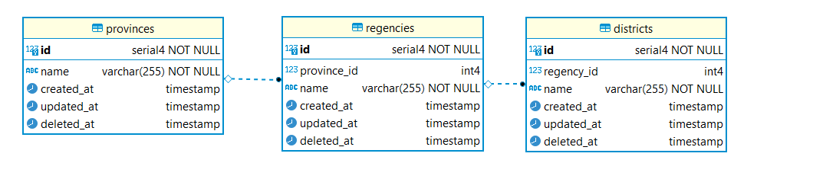
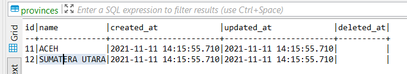
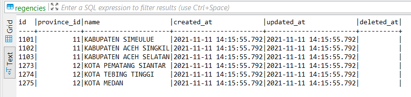
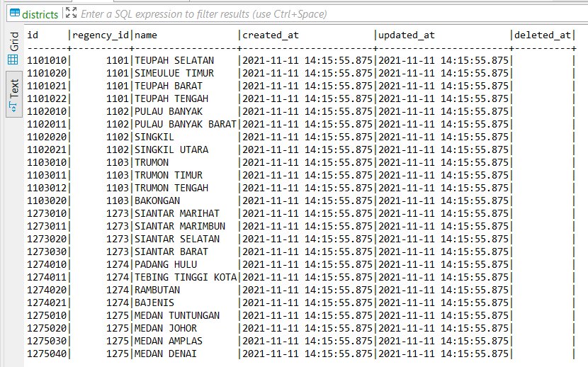

# 6th Week Backend Assessment
Assignment checklist
- [x] create database with a structure like the one below and its relationships
  
  
  
  
- [x] create crud API at least for 1 table. for example API to get, post, patch/put, and delete provinces

## Instructions
- Run ```npm i``` to install dependecies
- Run ```npm start``` to start the server.
- Run ```npm db@reset``` to restore database to original state

Server should be started on port 8000

## API
### GET
```GET /province``` to retrieve all provinces

Respond:
```json
[
  {
    "id": 1,
    "name": "JAWA SELATAN",
    "created_at": "2021-11-11T13:37:08.638Z",
    "updated_at": "2021-11-11T13:37:08.638Z",
    "deleted_at": null
  },
  {
    "id": 11,
    "name": "ACEH",
    "created_at": "2021-11-11T13:36:39.060Z",
    "updated_at": "2021-11-11T13:36:39.060Z",
    "deleted_at": null
  },
  {
    "id": 12,
    "name": "SUMATERA UTARA",
    "created_at": "2021-11-11T13:36:39.060Z",
    "updated_at": "2021-11-11T13:36:39.060Z",
    "deleted_at": null
  }
]

```

```GET /province/?id=12``` to get province by Id

Respond:
```json
{
  "id": 12,
  "name": "SUMATERA UTARA",
  "created_at": "2021-11-11T13:36:39.060Z",
  "updated_at": "2021-11-11T13:36:39.060Z",
  "deleted_at": null
}
```

### PUT
```PUT /province/?id=12&name=SULAWESI SELATAN``` to update province name by Id

Respond:
```json
{
  "id": 12,
  "name": "SULAWESI SELATAN",
  "created_at": "2021-11-11T13:36:39.060Z",
  "updated_at": "2021-11-11T13:43:42.219Z",
  "deleted_at": null
}
```

### DELETE
```DELETE /province/?id=11``` to delete province by Id

Respond:
```json
{
  "id": 11,
  "name": "ACEH",
  "created_at": "2021-11-11T13:36:39.060Z",
  "updated_at": "2021-11-11T13:36:39.060Z",
  "deleted_at": null
}
```