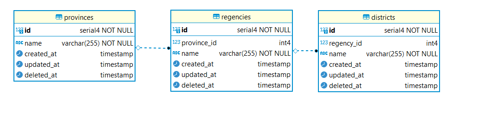
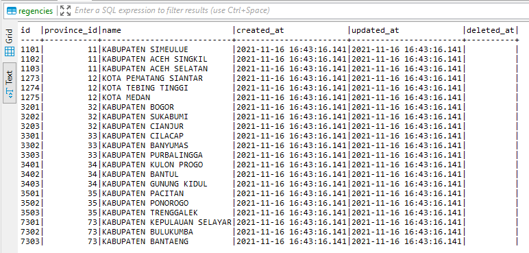
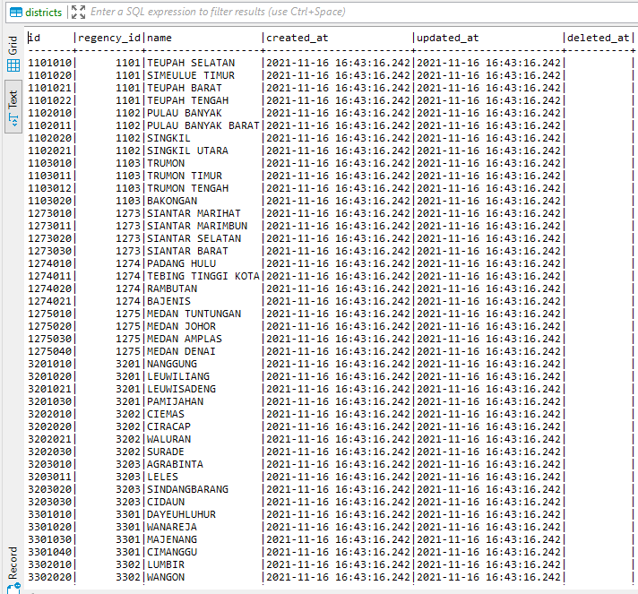

# TECH-TRYOUT 2

## Instructions
- Run ```npm i``` to install dependecies
- Run ```npm start``` to start the server.
- Run ```npm db@reset``` to restore database to original state

Server should be started on port 8000

## DATA BASE
  

  

  

  

## API
### Get province data by regency id
### ```GET api/province/?regencyId=3503```

Respond is province object in JSON:
```json
{
  "id": 35,
  "name": "JAWA TIMUR",
  "created_at": "2021-11-16T16:43:15.892Z",
  "updated_at": "2021-11-16T16:43:15.892Z",
  "deleted_at": null
}

```

### Get province data by district id
### ```GET api/province/?districtId=1103020```

Respond is province object in JSON:
```json
{
  "id": 11,
  "name": "ACEH",
  "created_at": "2021-11-16T16:43:15.892Z",
  "updated_at": "2021-11-16T16:43:15.892Z",
  "deleted_at": null
}
```

### Get list of regencies by province id
### ```GET api/regency/?provinceId=73```

Respond is array of regencies:
```json
[
  {
    "id": 7301,
    "province_id": 73,
    "name": "KABUPATEN KEPULAUAN SELAYAR",
    "created_at": "2021-11-16T16:43:16.141Z",
    "updated_at": "2021-11-16T16:43:16.141Z",
    "deleted_at": null
  },
  {
    "id": 7302,
    "province_id": 73,
    "name": "KABUPATEN BULUKUMBA",
    "created_at": "2021-11-16T16:43:16.141Z",
    "updated_at": "2021-11-16T16:43:16.141Z",
    "deleted_at": null
  },
  {
    "id": 7303,
    "province_id": 73,
    "name": "KABUPATEN BANTAENG",
    "created_at": "2021-11-16T16:43:16.141Z",
    "updated_at": "2021-11-16T16:43:16.141Z",
    "deleted_at": null
  }
]
```

### Get list of districts by province id
### ```GET api/district/?provinceId=73```

Respond is array of districts:
```json
[
  {
    "id": 7301010,
    "regency_id": 7301,
    "name": "PASIMARANNU",
    "created_at": "2021-11-16T16:43:16.242Z",
    "updated_at": "2021-11-16T16:43:16.242Z",
    "deleted_at": null
  },
  {
    "id": 7301011,
    "regency_id": 7301,
    "name": "PASILAMBENA",
    "created_at": "2021-11-16T16:43:16.242Z",
    "updated_at": "2021-11-16T16:43:16.242Z",
    "deleted_at": null
  },
  {
    "id": 7301020,
    "regency_id": 7301,
    "name": "PASIMASSUNGGU",
    "created_at": "2021-11-16T16:43:16.242Z",
    "updated_at": "2021-11-16T16:43:16.242Z",
    "deleted_at": null
  },
  {
    "id": 7301021,
    "regency_id": 7301,
    "name": "TAKABONERATE",
    "created_at": "2021-11-16T16:43:16.242Z",
    "updated_at": "2021-11-16T16:43:16.242Z",
    "deleted_at": null
  },
  {
    "id": 7302010,
    "regency_id": 7302,
    "name": "GANTARANG",
    "created_at": "2021-11-16T16:43:16.242Z",
    "updated_at": "2021-11-16T16:43:16.242Z",
    "deleted_at": null
  },
  {
    "id": 7302020,
    "regency_id": 7302,
    "name": "UJUNG BULU",
    "created_at": "2021-11-16T16:43:16.242Z",
    "updated_at": "2021-11-16T16:43:16.242Z",
    "deleted_at": null
  },
  {
    "id": 7302021,
    "regency_id": 7302,
    "name": "UJUNG LOE",
    "created_at": "2021-11-16T16:43:16.242Z",
    "updated_at": "2021-11-16T16:43:16.242Z",
    "deleted_at": null
  },
  {
    "id": 7302030,
    "regency_id": 7302,
    "name": "BONTO BAHARI",
    "created_at": "2021-11-16T16:43:16.242Z",
    "updated_at": "2021-11-16T16:43:16.242Z",
    "deleted_at": null
  },
  {
    "id": 7303010,
    "regency_id": 7303,
    "name": "BISSAPPU",
    "created_at": "2021-11-16T16:43:16.242Z",
    "updated_at": "2021-11-16T16:43:16.242Z",
    "deleted_at": null
  },
  {
    "id": 7303011,
    "regency_id": 7303,
    "name": "ULUERE",
    "created_at": "2021-11-16T16:43:16.242Z",
    "updated_at": "2021-11-16T16:43:16.242Z",
    "deleted_at": null
  },
  {
    "id": 7303012,
    "regency_id": 7303,
    "name": "SINOA",
    "created_at": "2021-11-16T16:43:16.242Z",
    "updated_at": "2021-11-16T16:43:16.242Z",
    "deleted_at": null
  },
  {
    "id": 7303020,
    "regency_id": 7303,
    "name": "BANTAENG",
    "created_at": "2021-11-16T16:43:16.242Z",
    "updated_at": "2021-11-16T16:43:16.242Z",
    "deleted_at": null
  }
]
```