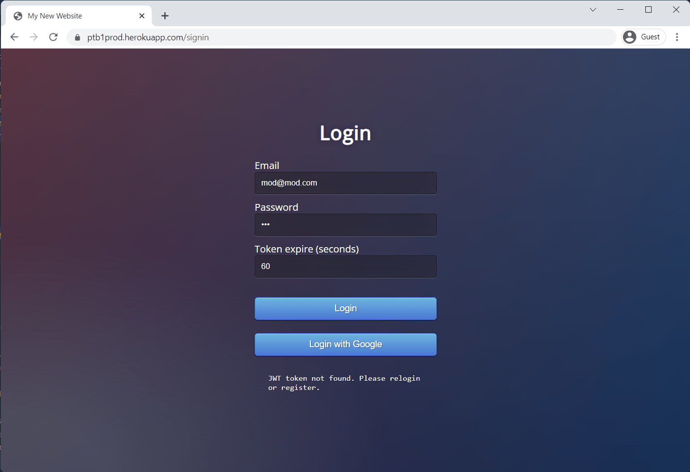

### Introduction

This project is for Week12 / Tech Tryout 3 weekly assesment project at PTB1 Glints Academy.

This project temporarily has been deployed in Heroku, please check this link:

### [https://ptb1prod.herokuapp.com](https://ptb1prod.herokuapp.com/)

There are already 3 built-in users registered in the database.

Simply sign-in using the below credentials:
| email            | password |
| ---------------- | -------- |
| admin@admin.com  | admin    |
| mod@mod.com      | mod      |
| user@user.com    | user     |

I used Postgres database hosted in Heroku.
I also used Redis for caching (powered by Redis Lab).

### Tasks / Todo List

- [x] API to sign in with jwt
- [x] API to sign in with passport
- [ ] Add a feature to sort/order by created_at in API Get All User
- [x] Implement either Facebook or Google Auth
- [x] Set expiration time in jwt for 25 minutes
- [x] Use both .verify and .decode method

### Instructions to run locally
To run this project locally, please follow below instructions:
- Clone this project
- Run ```npm i``` to install dependecies
- Run ```npm run nodemon``` to start the server.
- Create ```.env``` file for the environment variables, and put it in the root folder, using keys in the below.

```
NODE_PORT=8000

DATABASE_URL=your_data_base

ACCESS_TOKEN_KEY=some_key
ACCESS_TOKEN_EXPIRE=60
REFRESH_TOKEN_KEY=some_key_again
REFRESH_TOKEN_EXPIRE=24h

GOOGLE_CLIENT_ID=your_google_clienti_id
GOOGLE_CLIENT_SECRET=your_google_secret
GOOGLE_CALLBACK_URL=your_google_cb_url

REDIS_HOST=your_redis_host
REDIS_PORT=your_redis_port
REDIS_PASSWORD=your_redis_password
REDIS_DEFAULT_EXPIRE=your_redis_default_expire
```

If everytihing goes well, the app will started on port 8000.

## Front page

## Add user

## Protected page - without sign-in

## Protected page - after sign-in (authenticated)

## Sign-in page

## Sign-in with email

## Sign-in with Google


## DATA BASE
  

  

  

  