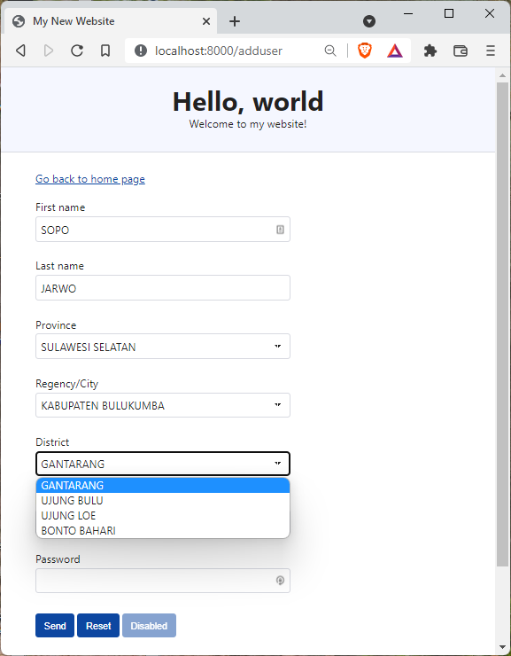
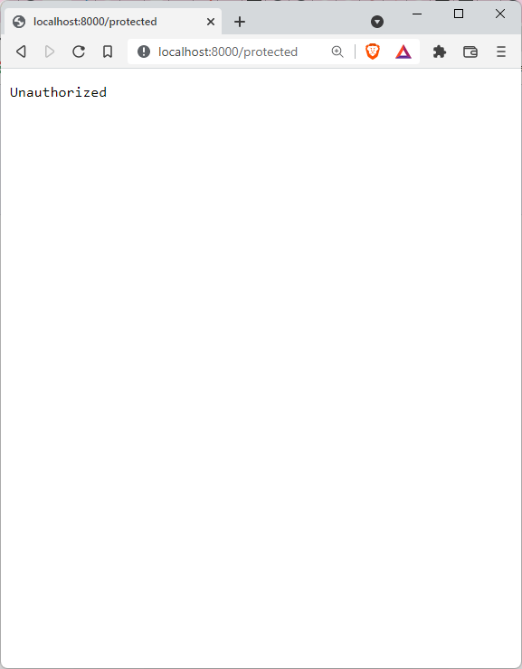
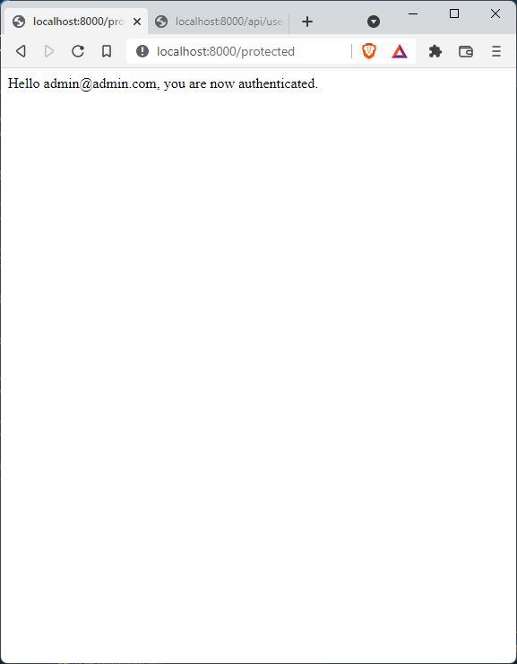

## DATA BASE
  

  

  

  

## Instructions
- Run ```npm i``` to install dependecies
- Run ```npm start``` to start the server.
- Run ```npm run db@reset``` to restore database to original state if using Linux
- Run ```npm run db@resetwin``` to restore database to original state if using Windows powershell

Server should be started on port 8000

## Getting started
There are already 3 built-in users registered in the database.

Simply sign-in using the below credentials:
| email            | password |
| ---------------- | -------- |
| admin@admin.com  | admin    |
| mod@mod.com      | mod      |
| user@user.com    | user     |


## Front page

## Add user

## Protected page - without sign-in

## Protected page - after sign-in (authenticated)

## Sign-in page

## Sign-in with email

## Sign-in with Google
